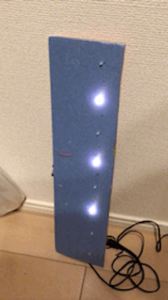

# illumi_2019
Arduino + LED = X'mas



## Arduinoソースコード
```
#define SRCLK   (5)
#define RCLK    (6)
#define SER     (7)

void setup() {
  pinMode(SRCLK, OUTPUT);
  pinMode(RCLK,  OUTPUT);
  pinMode(SER,   OUTPUT);
}

void loop() {
  int max_pattern = 8;
  //○○○●○●○●
  uint8_t h = 1+4+16;
  for (uint8_t i=0; i<max_pattern; i++) {
    shiftOut(SER, SRCLK, LSBFIRST, h<<i);
    //○○○●○●○●
    //○○●○●○●○
    //○●○●○●○○
    //●○●○●○○○
    //○●○●○○○○
    //●○●○○○○○
    //○●○○○○○○
    //●○○○○○○○
    digitalWrite(RCLK,  LOW);
    digitalWrite(RCLK,  HIGH);
    delay(200);
  }
  //●○●○●○○○
  uint8_t j = 128+32+8;
  for (uint8_t i=0; i<max_pattern; i++) {
    shiftOut(SER, SRCLK, LSBFIRST, j>>i);
    //●○●○●○○○
    //○●○●○●○○
    //○○●○●○●○
    //○○○●○●○●
    //○○○○●○●○
    //○○○○○●○●
    //○○○○○○●○
    //○○○○○○○●
    digitalWrite(RCLK,  LOW);
    digitalWrite(RCLK,  HIGH);
    delay(200);
  }
}
```
